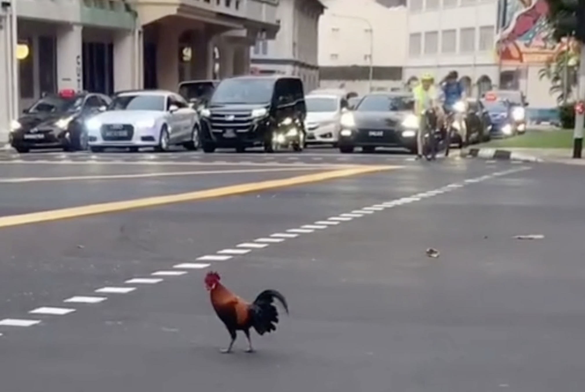

# Stream-VLM: Stream video to Apple's FastVLM using ffmpeg for captioning / descriptions

Apple's FastVLM repository comes with a demo predict.py that works with an image, and also iOS/MacOS apps to demo its features.

This project uses ffmpeg to pipe video, images, including video streams to FastVLM for interpretation.


## Prerequisites

-   Python 3.10
-   FFmpeg

## Setup

1.  **Clone the repository:**
    ```bash
    git clone https://github.com/your-username/stream-fastvlm.git
    cd stream-fastvlm
    ```

2.  **Create and activate a virtual environment:**
    ```bash
    python3 -m venv venv
    source venv/bin/activate
    ```

3.  **Download Model Weights:**
    Download FastVLM's model and place it in a known directory. The example command below points to local folders (e.g., `./checkpoints/llava-fastvithd_0.5b_stage3`), so adjust the path as needed.

## Usage


1.  **Find your RTSP stream URL.** This is specific to your camera or video source.
2.  **Determine the stream's resolution (width and height).** You can often find this in your camera's documentation or by using tools like `ffprobe`.
3.  **Run the application** using the following command structure:

    ```bash
    ffmpeg -i "rtsp://<YOUR_RTSP_URL>" -f rawvideo -pix_fmt bgr24 - \
    | python video_stream.py --width <STREAM_WIDTH> --height <STREAM_HEIGHT> --model-path <PATH_TO_YOUR_MODEL>
    ```

### Example

Here is a complete example using a hypothetical RTSP URL and a 1280x720 resolution stream:

```bash
ffmpeg -i "rtsp://<id>:<your_password>@<ip address>:554/<streamId>" -f rawvideo -pix_fmt bgr24 - \
| python video_stream.py --width 1280 --height 720 --model-path ./checkpoints/llava-fastvithd_0.5b_stage3 --prompt "Describe this scene."
```

The script will open a window displaying the video feed, and you will see timestamped descriptions appearing in your console. Press `q` with the video window in focus to quit.

This is another example that describes an image:

```bash
ffmpeg -i "rtsp://<id>:<your_password>@<ip address>:554/<streamId>" -f rawvideo -pix_fmt bgr24 - \
| python video_stream.py --width 1280 --height 720 --model-path ./checkpoints/llava-fastvithd_0.5b_stage3 --prompt "Describe this scene."
```

Test image




### Command-Line Arguments

-   `--model-path`: (Required) Path to the VLM checkpoint.
-   `--width`: (Required) Width of the input video stream.
-   `--height`: (Required) Height of the input video stream.
-   `--prompt`: The prompt to use for generating descriptions. Default: `"Describe the scene in detail."`
-   `--conv-mode`: The conversation template to use (e.g., `qwen_2`, `llava_v1`). Default: `"qwen_2"`.
-   `--temperature`, `--top_p`, `--num_beams`: Standard model generation parameters.

## Acknowledgements

This project utilizes components and concepts from the LLaVA (Large Language and Vision Assistant) project. Please refer to their repository for details on their license and original work.

